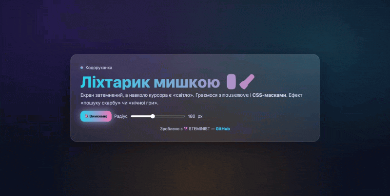

# 🖱️🔦 Ліхтарик мишкою (CSS‑маска)

Ефект: екран затемнений, а навколо курсора/пальця є «світло». Чудово для демонстрації **mousemove** та **CSS‑масок**.

## 🎯 Завдання
- Створити вуаль (темний шар) поверх сцени.
- Застосувати `mask`/`-webkit-mask` з **radial-gradient**, щоб зробити «дірку світла» в місці курсора.
- Оновлювати координати через `mousemove`/`touchmove` → змінювати CSS‑змінні `--x`, `--y`.
- Дати користувачу керування радіусом світла (range) та перемикач увімк/вимк.

## 🧠 Що потрібно знати
- **CSS mask**: як працює альфа‑маскування; що таке прозора/непрозора частина маски.
- **radial-gradient(...) at x y** для позиціювання «дірки».
- **CSS custom properties** (`--x`, `--y`, `--r`) та оновлення їх з JS.
- Обробка подій `mousemove`, `touchstart/move`; адаптація до мобільних (`(hover: none)`).
- Скляні картки: `backdrop-filter`, градієнти, легкі неонові акценти.

## 🚀 Як запустити
1. Відкрий `index.html` у браузері.
2. Рухай курсор/палець — бачиш «світло».
3. Слайдером змінюй радіус. Кнопкою можна вимкнути ефект.

## ✅ Acceptance Criteria
- Світло гладко слідує за курсором/пальцем.
- Радіус змінюється в реальному часі.
- Вимкнення робить вуаль прозорою (ефект не заважає контенту).
- Працює на десктопі та мобільних.
- Є футер з посиланням STEMINIST.

## 💜 Авторство
Зроблено з любов’ю — **STEMINIST** → [GitHub](https://github.com/steminist-ua)
